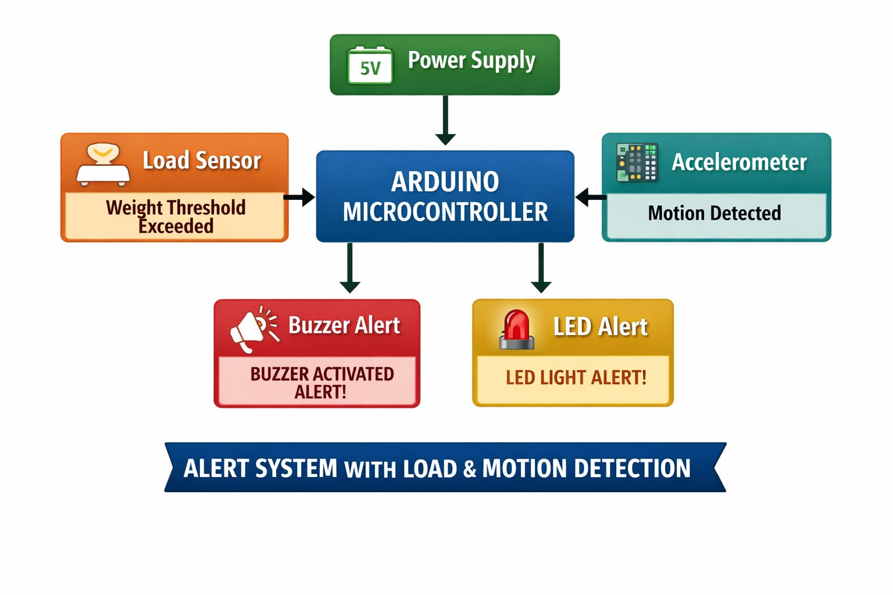
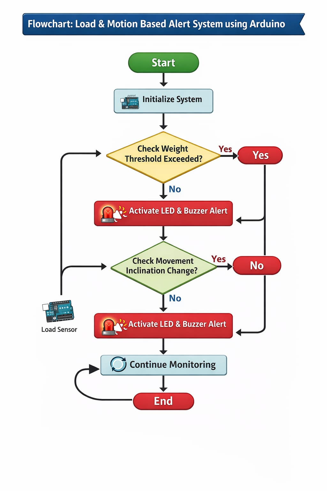
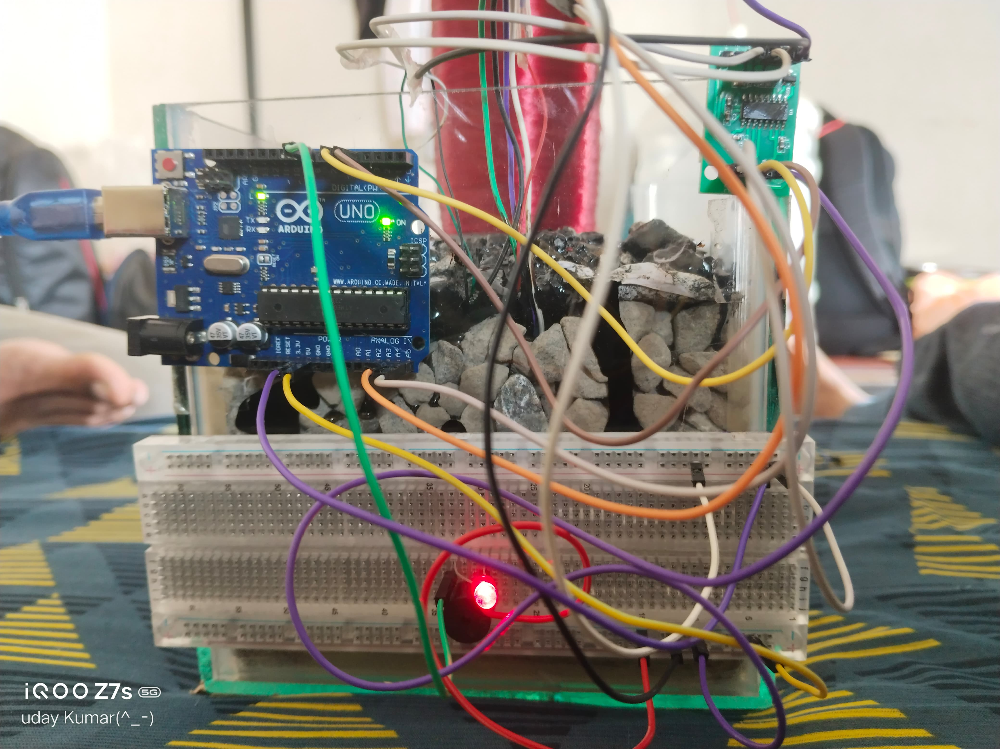
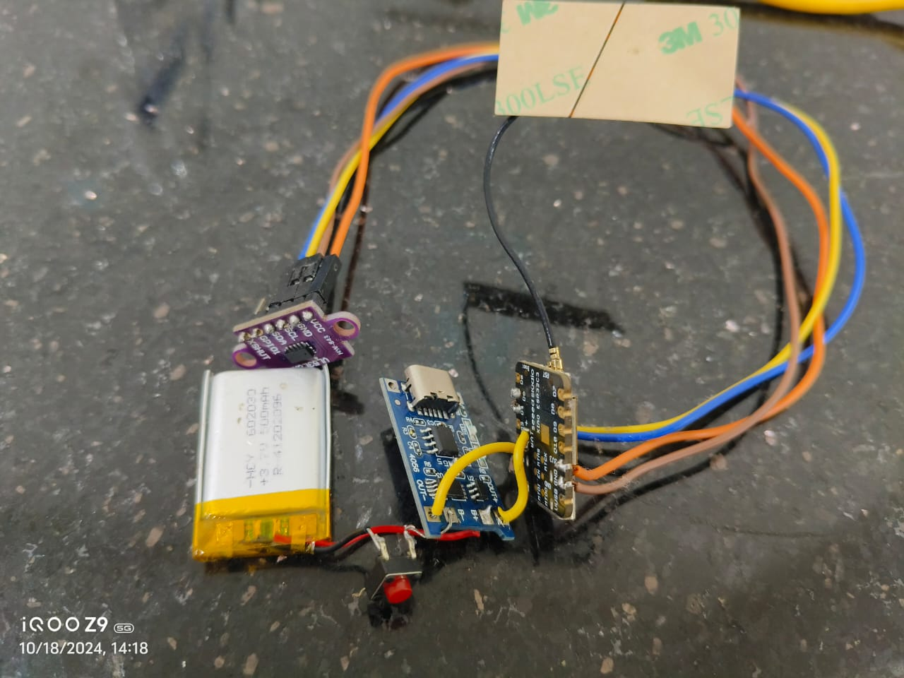

# 🛣️ Pavement Failures Early Detection System

### Sensor-Based Predictive Maintenance using Arduino

  
  
  
  

  <b>An intelligent early warning system that detects pavement stress and potential failures before visible damage occurs.</b> 
  Combining load sensing and motion detection for predictive road maintenance.

---

## 🌟 Project Vision

Traditional road maintenance is **reactive** — problems like cracks, rutting, and potholes are fixed only after they become severe.  

This project proposes a **predictive approach** using embedded sensors to monitor pavement behavior under load and vibration in real time. By detecting unusual patterns early, we can improve road safety, reduce repair costs, and support sustainable infrastructure management.

---

## ✨ Key Features

| Feature                        | Description                                      |
|--------------------------------|--------------------------------------------------|
| ⚖️ **Load Sensing**            | HX711 + Load cell detects weight threshold       |
| 📡 **Motion Detection**        | ADXL345 Accelerometer senses vibration & tilt    |
| 🚨 **Dual Alert System**       | LED + Buzzer activated on anomaly                |
| 📊 **Real-time Monitoring**    | Continuous data logging via Serial Monitor       |
| 🧪 **Prototype Validated**     | Tested with simulated pavement (stone/gravel)    |
| 🔋 **Low-cost & Portable**     | Arduino-based, easy to deploy                    |

---

## 🧠 How It Works

Load Sensor (Weight) ──────┐
                           ├──→ Arduino Uno ──→ LED + Buzzer Alert
Accelerometer (Motion) ────┘

1. System continuously monitors **weight** on the pavement surface.
2. Simultaneously tracks **acceleration / inclination** changes.
3. If **weight exceeds threshold** **OR** **sudden motion/tilt** is detected → Alert is triggered.
4. Data is displayed in real-time on the Serial Monitor.

---

## 🛠️ System Architecture

### Block Diagram

### Flowchart

---

## 🔌 Hardware Used

- **Arduino Uno**
- **HX711 Load Cell Amplifier** + Load Cell
- **ADXL345 Accelerometer**
- LED (Alert indicator)
- Buzzer
- 5V Power Supply / Battery
- Breadboard & Jumper wires
- Glass container with stones (for prototype simulation)

---

## 💻 Working Demonstration

The system was tested using a glass container filled with stones and gravel to simulate a pavement surface.

- When weight is applied beyond the set threshold → **Alert triggers**
- When sudden pressure or movement occurs → **Alert triggers**
- Real-time weight and accelerometer values are printed on the Serial Monitor

### Sample Serial Output

Device: A | Weight(g): 0.00 | ADXL raw → X:1 Y:2 Z:3 | STATUS: below
Device: A | Weight(g): 9.82 | ADXL raw → X:1 Y:2 Z:3 | STATUS: below
Device: A | Weight(g): 11.63 | ADXL raw → X:1 Y:2 Z:3 | STATUS: ABOVE_THRESHOLD
--- ALERT: Weight exceeded threshold! Sending data ---

---

## 📸 Project Gallery

| Prototype Setup | Testing in Progress | Hardware Close-up |
|-----------------|---------------------|-------------------|
|  |  | See videos for full demo |

**Videos available in the repository:**
- `Final_Output_vid01.mp4`
- `Final_Output_vid02.mp4`
- `Final_Output_vid03.mp4`

---

## 🎯 Advantages

- Early detection of potential pavement failures
- Low-cost and easy to implement
- Real-time monitoring capability
- Can be scaled for multi-point road monitoring
- Supports shift from reactive → predictive maintenance

---

## 🚀 Future Scope

- [ ] Wireless data transmission (ESP32 / LoRa)
- [ ] Cloud dashboard for remote monitoring
- [ ] Multiple sensor nodes along a road stretch
- [ ] Machine Learning for pattern recognition
- [ ] Integration with municipal road management systems
- [ ] Solar-powered outdoor deployment

---

## 👨‍💻 Contributors

<table>
  <tr>
    <td align="center">
      <a href="https://github.com/Sai1833">
         
        <b>Sai Prakash</b>
      </a>
    </td>
    <td align="center">
      <a href="https://github.com/manohar0306-art">
         
        <b>Manohar</b>
      </a>
    </td>
    <td align="center">
      <a href="https://github.com/Bhanu-79">
         
        <b>Bhanu</b>
      </a>
    </td>
  </tr>
</table>

---

## 📄 Documentation

Full project report is available in:  
**`Pavement_Failure_Early_Detection.doc`**

---

  <b>Detect early. Repair smarter. Drive safer.</b> 
  <i>A step towards intelligent and sustainable road infrastructure.</i>

  ★ Star this repository if you find it useful ★

